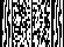
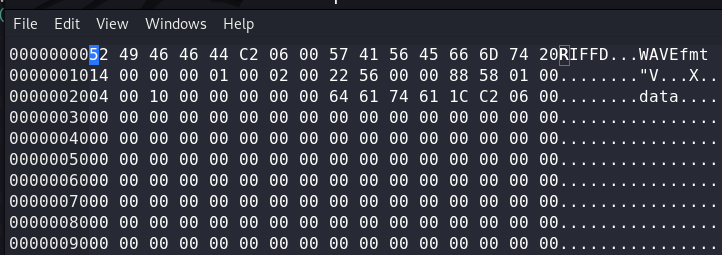

# FORENSICS

## USEFUL TIPS AND RESOURCE

1. Online Stego Tool [StegTool](https://stegonline.georgeom.net/image)
2. Exiftool ``` exiftool file ```
3. Binwalk ``` binwalk -e file```
4. Ghex 
5. Foremost ```foremost -T file ```
6. dd ```dd if=file1 bs=1 skip=362201 of=file2``` (file1 is the initial file, skip 362201 bytes , store data in file2)
7. pngcheck (for checking png chunks) ```pngcheck -v file``` (for details)
8. zsteg (for LSB steganography in png) ``` zsteg -a file ```
9. jsteg (for jpg files)
10. Xiao steganography (for windows) (also applicable for wav)
11. Registry Viewer (windows tool - for viewing registry)
12. [LSB Stego TOOL](https://github.com/ra1nb0rn/lsb_image_stego)
13. ```7za e file.7a``` for extracting 7z
14. Use gimp to see all the frames in a gif
15. [pdf417](https://products.aspose.app/barcode/recognize/pdf417) looks like ->
<center></center>

16. Script For Xor of two files [Script](../Scripts/3.py)
17. ```tcpflow -r data.pcapng``` get the tcp packets
18. If you think you get any challenge related to Discrete Fourier Transform use -> [Script](../Scripts/6.py)
19. [FIND LSB IN AUDIO STEG](https://github.com/ragibson/Steganography) ```stegolsb wavsteg -r -i sound_steg.wav -o output.txt -n 1 -b 1000``` -i input , -o output , -b bytes
20. Use [StegSnow](http://manpages.ubuntu.com/manpages/bionic/man1/stegsnow.1.html) ```stegsnow -C -p "hello world" outfile``` -p password
21. There is also [Base91](https://www.dcode.fr/base-91-encoding) ;~; eg. ```l5VKJpn`Y!%/Ev#qOzj:j9tN;L```
22. Use Sonic Visualizer >>> Audacity ```pane->spectogram```
23. Extract Tar ```tar -xvf archive.tar.gz```
24. [PNG Check and Correct](https://github.com/sherlly/PCRT) ```python PCRT.py -i infile -o outfile```
25. [PNG Details](https://hackmd.io/@FlsYpINbRKixPQQVbh98kw/Sk_lVRCBr) Good Details about PNG.
26. [Grocery List Esoteric](http://progopedia.com/language/grocery-list/)

<hr>

### Random 

1. We are given a zip file with name 60*50 and after extracting we get 3000 files. Upon looking closely it is clear we need to merge them to get a single image. [Script](../Scripts/7.py)
2. We are given a .pcapng . One of the data packets contain a password to zip and the other contain zip but in reversed order. To extract the zip -> [script](../Scripts/8.py)

### Foobar CTF

1. So there was a file , upon close introspectio it was visible that there were some other bits at the end column of the image . There were two RGB values other than normal black and white . Here's the script to find flag -> [script](../Scripts/1.py)
2. Got Pcap file . Merged All data in one file and found a .wav . Here's the script for merging -> [script](../Scripts/2.py) Had to remove some initial bits -> 
    
3. <b>Xiao Challenge</b> Great Forensic Challenge
-   Walkthrough : This challenge has two parts

    Part 1:
    1. Player obtains a .wav file and an image file.
    2. Analyse the .wav file through sonic visualiser to obtain the image of an encoded link embedded at the end of the file. (Identify the encoding to be base91)
    3. Follow the link to obtain a downloadable file from drive.
    4. It has a compressed text file with half of the flag hidden by SNOW steg.(Read the poem, it is Dust of SNOW)
    5. Player obtains the first half of the flag by using stegsnow.

    Part 2:
    1. On analysing the image given initially, player finds a base64 string appended to the end of the image.
    2. Decode it to get the password for the xiao extraction of the .wav file.(Here a clear hint was the challenge title. Again on listening to the audio you could figure that there was a lot of background noise which could be a red flag.)
    3. The extracted file contains a second .wav file that has the other part of the flag encoded in its LSB.

    Tools used : Xiao Steganography, stegsnow.