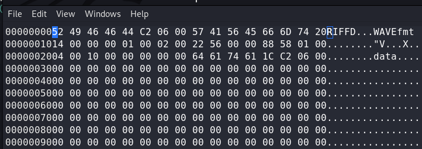

# Foobar CTF

1. So there was a file , upon close introspectio it was visible that there were some other bits at the end column of the image . There were two RGB values other than normal black and white . Here's the script to find flag ->
    ```python
    #!/usr/bin/env python3

    from PIL import Image

    img = Image.open("flag.png")
    w, h = img.size
    data = img.load()
    seen = [] # to hold the list of pixels present.
    seen.append(data[0,0])
    for i in range(w):
        for j in range(h):
            color = data[i, j]
            # print(color)
            if (color not in seen):
                seen.append(color)
    # print(seen) 
    zero = (0,1,1,255)
    one = (0,1,2,255)
    bin_flag = ""
    for i in range(w):
        for j in range(h):
            color = data[i,j]
            if(color == zero):
                bin_flag += "0"
            elif(color == one):
                bin_flag += "1"
    #print(bin_flag)
    bin_flag = int(bin_flag, 2)
    flag = bin_flag.to_bytes((bin_flag.bit_length() + 7) // 8, 'big').decode()
    # print(flag)
    ```
2. Got Pcap file . Merged All data in one file and found a .wav . Here's the script for merging -> 
    ```python
    from scapy.all import *

    packets = rdpcap('find_me.pcapng')

    bytes = (packets[0][Raw].load + packets[1][Raw].load + packets[2][Raw].load + packets[2][Raw].load)
    f = open("sample.wav", "wb")
    f.write(bytes)
    f.close()
    ```

    Had to remove some initial bits -> 
    
3. <b>Xiao Challenge</b> Great Forensic Challenge
-   Walkthrough : This challenge has two parts

    Part 1:
    1. Player obtains a .wav file and an image file.
    2. Analyse the .wav file through sonic visualiser to obtain the image of an encoded link embedded at the end of the file. (Identify the encoding to be base91)
    3. Follow the link to obtain a downloadable file from drive.
    4. It has a compressed text file with half of the flag hidden by SNOW steg.(Read the poem, it is Dust of SNOW)
    5. Player obtains the first half of the flag by using stegsnow.

    Part 2:
    1. On analysing the image given initially, player finds a base64 string appended to the end of the image.
    2. Decode it to get the password for the xiao extraction of the .wav file.(Here a clear hint was the challenge title. Again on listening to the audio you could figure that there was a lot of background noise which could be a red flag.)
    3. The extracted file contains a second .wav file that has the other part of the flag encoded in its LSB.

    Tools used : Xiao Steganography, stegsnow.