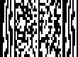

# FORENSICS

## USEFUL TIPS AND RESOURCE

1. Online Stego Tool [StegTool](https://stegonline.georgeom.net/image)
2. Exiftool ``` exiftool file ```
3. Binwalk ``` binwalk -e file```
4. Ghex 
5. Foremost ```foremost -T file ```
6. dd ```dd if=file1 bs=1 skip=362201 of=file2``` (file1 is the initial file, skip 362201 bytes , store data in file2)
7. pngcheck (for checking png chunks) ```pngcheck -v file``` (for details)
8. zsteg (for LSB steganography in png) ``` zsteg -a file ```
9. jsteg (for jpg files)
10. Xiao steganography (for windows) (also applicable for wav)
11. Registry Viewer (windows tool - for viewing registry)
12. [LSB Stego TOOL](https://github.com/ra1nb0rn/lsb_image_stego)
13. ```7za e file.7a``` for extracting 7z
14. Use gimp to see all the frames in a gif
15. [pdf417](https://products.aspose.app/barcode/recognize/pdf417) looks like ->
<center></center>

16. Script For Xor of two files
    ```python
    import sys

    # Read two files as byte arrays
    file1_b = bytearray(open(sys.argv[1], 'rb').read())
    file2_b = bytearray(open(sys.argv[2], 'rb').read())

    # Set the length to be the smaller one
    size = len(file1_b) if len(file1_b) < len(file2_b) else len(file2_b)
    xord_byte_array = bytearray(size)

    # XOR between the files
    for i in range(size):
        xord_byte_array[i] = file1_b[i] ^ file2_b[i]

    # Write the XORd bytes to the output file	
    open(sys.argv[3], 'wb').write(xord_byte_array)

    print ("[*] %s XOR %s\n[*] Saved to \033[1;33m%s\033[1;m."%(sys.argv[1], sys.argv[2], sys.argv[3]))
    ```
17. ```tcpflow -r data.pcapng``` get the tcp packets
18. If you think you get any challenge related to Discrete Fourier Transform use ->
    ```python
    '''
    It turns out that if we load the data we are given in numpy, perform a fast fourier transform on it and plot the resulting samples with the real part on the x-axis and the imaginary part on the y-axis, we can see the flag
    '''

    import numpy as np
    import matplotlib.pyplot as plt

    data = np.array(['''Put Array HERE'''])

    s = np.fft.fft(data)

    plt.plot(s.real, s.imag)
    plt.show()
    ```
19. [FIND LSB IN AUDIO STEG](https://github.com/ragibson/Steganography) ```stegolsb wavsteg -r -i sound_steg.wav -o output.txt -n 1 -b 1000``` -i input , -o output , -b bytes
20. Use [StegSnow](http://manpages.ubuntu.com/manpages/bionic/man1/stegsnow.1.html) ```stegsnow -C -p "hello world" outfile``` -p password
21. There is also [Base91](https://www.dcode.fr/base-91-encoding) ;~; eg. ```l5VKJpn`Y!%/Ev#qOzj:j9tN;L```
22. Use Sonic Visualizer >>> Audacity ```pane->spectogram```
23. Extract Tar ```tar -xvf archive.tar.gz```
24. [PNG Check and Correct](https://github.com/sherlly/PCRT) ```python PCRT.py -i infile -o outfile```
25. [PNG Details](https://hackmd.io/@FlsYpINbRKixPQQVbh98kw/Sk_lVRCBr) Good Details about PNG.
26. [Grocery List Esoteric](http://progopedia.com/language/grocery-list/)
27. ```help(class)``` gives info about a class. Usefull in pyjail.
28. [Twitter Steganography](https://holloway.nz/steg/) - to find hidden messages in twitter

<hr>

### [FOOBAR CTF](./FoobarCTF.md)

### [RANDOM](./Random.md)