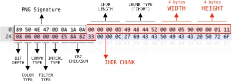

# Random 

1. We are given a zip file with name 60*50 and after extracting we get 3000 files. Upon looking closely it is clear we need to merge them to get a single image.
    ```python
    from PIL import Image
    new_image = Image.new('RGB',(600, 500), (250,250,250))
    for i in range(1,3001):
        image1 = Image.open('60x50/' + str(i) + '.jpg')
        # image1 = image1.resize((100,100))
        new_image.paste(image1,(((i-1)//50)*10,((i-1)%50)*10))
    new_image.show()
    ```
2. We are given a .pcapng . One of the data packets contain a password to zip and the other contain zip but in reversed order. To extract the zip ->
    ```python
    from scapy.all import *

    packets = rdpcap('network2.pcapng')

    temp = bytes("",'utf-8')

    lmao = packets[66][Raw].load[::-1]

    file = open("out.zip","wb")
    file.write(lmao)
    file.close()
    ```
3. Tamu CTF had a recovery image with .img extension [link](https://neg9.org/writeups/tamuctf-2021-recovery-solution/)

4. PNG image -> 
    

5. We have say many corrupted files with same kind of corruption , Code to correct it ->
    ```python
    mypath = "images"
    outputPath = "output"

    def fixImage(filename):

        header = [137, 80, 78, 71, 13, 10, 26, 10]
        headerBinary = bytearray(header) 

        inputFile = open(mypath + "/" + filename, 'r+b')

        inputFileBytes = bytearray(inputFile.read())

        headerBinary.extend(inputFileBytes[len(header):])

        outputFile = open(outputPath + "/" + filename, 'w+b')

        outputFile.write(headerBinary)
        outputFile.close()
        inputFile.close()

    from os import listdir
    from os.path import isfile, join
    onlyfiles = [f for f in listdir(mypath) if isfile(join(mypath, f))]

    for filename in onlyfiles:
        fixImage(filename)
    ```
    The original corrupted PNG files contained a clue. The 3rd and 4th bytes were different across files... interesting. Running the same script again, but naming the output images with the hex values of those bytes revealed that those were in fact the coordinates for where that piece should be on the final image. The first byte represents the x coordinate and the second byte the y coordinate.

    ```python
    mypath = "images"
    outputPath = "output"

    def fixImage(filename):

        header = [137, 80, 78, 71, 13, 10, 26, 10]
        headerBinary = bytearray(header) 

        inputFile = open(mypath + "/" + filename, 'r+b')

        inputFileBytes = bytearray(inputFile.read())

        headerBinary.extend(inputFileBytes[len(header):])

        newfileName = inputFileBytes[2:4] #PNG magic numbers
        outputFile = open(outputPath + "/" + newfileName.hex() + ".png", 'w+b')

        outputFile.write(headerBinary)
        outputFile.close()
        inputFile.close()

    from os import listdir
    from os.path import isfile, join
    onlyfiles = [f for f in listdir(mypath) if isfile(join(mypath, f))]

    for filename in onlyfiles:
        fixImage(filename, outputPath + "/" + filename)
    ```
    Now make one image out of it ->
    ```python
    import sys
    from PIL import Image
    from os import listdir
    from os.path import isfile, join
    from shutil import copyfile

    mypath = "output"

    allImages = [f for f in listdir(mypath) if isfile(join(mypath, f))]

    new_im = Image.new('RGB', (2985, 1485))

    x_offset = 0

    for im in allImages:
        imageFile = Image.open("output/" + im)

        # Multiply by 15 since each image is 15x15

        xPos = int("0x" + im[0:2], 0) * 15 
        yPos = int("0x" + im[2:4], 0) * 15

        new_im.paste(imageFile, (xPos, yPos))

    new_im.save('flag.png') 
    ```
7. When Some picture contains jumbled pixels ->
    ```python
    np.random.seed(420)
    size = 1280
    img = cv2.imread(image)
    img_arr = np.asarray(img)
    for i in range(img_arr.shape[0]):
        indexes = list(range(size))
        np.random.shuffle(indexes)
        arr = img_arr[i]
        res = [0] * size
        for j, index in enumerate(indexes):
            result[index] = arr[j] 
        img_arr[i] = np.array(res)  
    gray_color = cv2.cvtColor(img, cv2.COLOR_BGR2GRAY)
    cv2.imwrite(‘image.jpg', gray)
    ```

7. [SSTV writeup](https://github.com/cieran/writeups/blob/main/DragonCTF/misc/ETComm.md)