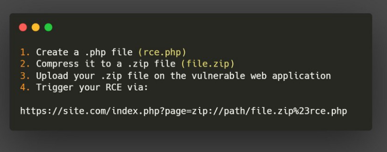

# WEB CHALLENGES

## Useful Tips And Resource

1. Use ```dirb``` to find out some directories we can view.
2. Useful SQLi -> ``` admin';--``` (works most of the time)
3. See for Template Injection by ```{{4+4}}``` if it shows 8 , then it's a SSTL.
4. [File Upload Bypass](https://vulp3cula.gitbook.io/hackers-grimoire/exploitation/web-application/file-upload-bypass) 
5. [Web Exploits](https://vulp3cula.gitbook.io/hackers-grimoire/exploitation/web-application)
6. [Pen Testing Handbook](https://blueteamdope.gitbook.io/penetration-testing-playbook/)
7. If you Find SSTI use ```{{config}}```
8. ZipSlip Vuln [SRC](https://snyk.io/research/zip-slip-vulnerability)
9. Command For using symlink and then upload -> 
    
10. Another type of zip vuln -> 
    
11. [Deobfuscater and Unpacker](https://lelinhtinh.github.io/de4js/)
12. You can try for sending HEAD request to a url.

<hr>

### [FOOBAR CTF](./FoobarCTF.md)

### [ANGSTROM](./AngstromCTF.md)

### [Random](./Random.md)
